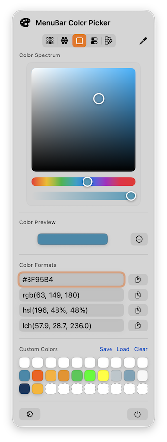

# MenuBarColorPicker

Eine macOS SwiftUI `MenuBarExtra` App, die eine kuratierte Farbpalette sowie eigene Farben anbietet und Farben in mehreren Formaten ins Clipboard kopieren kann.

---

## Screenshot

---

## Features
- Fancy Farbpalette im Menu Bar Fenster
- Kopieren in `Hex`, `RGB(A)`, `HSL(A)`, `HSB`, `CMYK`, `LAB`, `LCH`
- Hex-Format konfigurierbar: `#` an/aus, `uppercase/lowercase`
- Dock Icon an/aus
- Autostart bei Anmeldung
- Color Picker mit runder Lupe und Farbauswahl am Bildschirm
- Persistente Liste eigener Farben (30 Slots)
- Zusätzliche Farblisten: Developer, Web Safe, CSS Named Colors, RAL Classic (angenähert)
- Formatfelder editierbar (Input in allen Formaten möglich)
- Pro-Format Ein/Aus-Schalter zur Performance-Optimierung

## Anforderungen
- macOS 14+ (Screen Recording Berechtigung wird fuer den Color Picker benoetigt)
- Xcode 15+ (SwiftUI, MenuBarExtra)

## Build & Run
1. Projekt in Xcode oeffnen (`MenuBarColorPicker.xcodeproj`)
2. Build & Run

## Bedienung
- Swatch anklicken: selektiert die Farbe.
- Unter `Color Formats` die Werte anzeigen und ueber den Copy-Button ins Clipboard kopieren.
- Palette-Ansicht ueber die Icon-Schalter wechseln (Swatches, Color Wheel, Spectrum, Slider, Color List).
- Color Picker starten: Farbe waehlen, wird zu den eigenen Farben hinzugefuegt und ins Clipboard kopiert.
- Einstellungen ueber `Settings` oeffnen.

## Einstellungen
- `Hex uppercase`: Gross- oder Kleinschreibung.
- `Hex with # prefix`: Fuegt ein `#` voran.
- `Color Formats`: Pro-Format anzeigen/ausblenden (HEX, RGB, HSL, HSB, CMYK, LAB, LCH).
- `Show Dock icon`: Dock Icon an/aus.
- `Launch at login`: Autostart bei Anmeldung.

## Color Picker Hinweis
Der Color Picker nutzt Screen Recording fuer das Einlesen des Bildschirms. macOS kann dafuer eine Berechtigung verlangen. In manchen Setups wird auch Input Monitoring fuer globale Klicks benoetigt.

## Persistence
Eigene Farben werden als JSON in `UserDefaults` gespeichert. Die UI zeigt feste Platzhalter, sobald weniger als 30 Farben vorhanden sind.

## TODO
- [x] MenuBarExtra App-Struktur mit Settings Scene aufsetzen
- [x] Fancy Palette UI mit Format-Auswahl und Clipboard Copy
- [x] Hex-Optionen (Prefix/Uppercase) konfigurieren und anwenden
- [x] Dock Icon Toggle
- [x] Autostart Toggle (Login Item)
- [x] Color Picker mit runder Lupe und Farbauswahl implementieren
- [x] Persistente Liste eigener Farben inkl. Platzhaltern
- [x] Dokumentation mit Funktionsdetails ergaenzen
