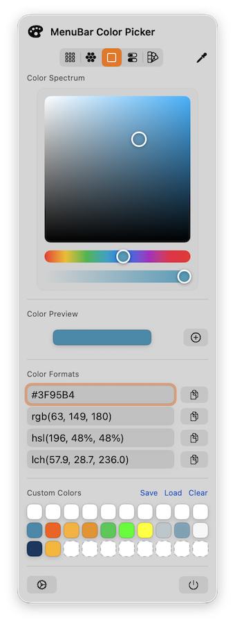

# MenuBarColorPicker

MenuBarColorPicker is a macOS `MenuBarExtra` app that turns colour picking into a one-click affair. It offers a curated colour palette plus persistent custom colours, an on-screen loupe picker that reads any pixel on your display, and instant copy to the clipboard in every common colour format — ready to paste straight into code, design tools, or documents.

---

## Screenshot



---

## Features
- Fancy color palette in the menu bar window
- Copy in `Hex`, `RGB(A)`, `HSL(A)`, `HSB`, `CMYK`, `LAB`, `LCH`
- Configurable hex format: `#` on/off, `uppercase/lowercase`
- Dock icon on/off
- Launch at login
- Color picker with round loupe and on-screen color selection
- Persistent list of custom colors (30 slots)
- Additional color lists: Developer, Web Safe, CSS Named Colors, RAL Classic (approximated)
- Editable format fields (input in all formats supported)
- Per-format on/off switches for performance optimization

---

## Requirements
- macOS 15.2 or later (Screen Recording permission is required for the color picker)
- Apple Silicon only
- Xcode 15+ (SwiftUI, MenuBarExtra)

---

## Installation

### Build from source
1. Open the project in Xcode (`MenuBarColorPicker.xcodeproj`)
2. Build & Run

### Prebuilt DMG

A ready-to-run build is available as `MenuBarColorPicker-1.0.dmg` (ad-hoc signed, Apple Silicon only). Since it isn't notarized by Apple, macOS blocks it on first launch. Remove the quarantine flag before opening:

```bash
xattr -dr com.apple.quarantine /Applications/MenuBarColorPicker.app
```

Alternatively, right-click the app in Finder and choose "Open".

---

## Usage
- Click a swatch: selects the color.
- Under `Color Formats`, view values and copy to the clipboard via the copy button.
- Switch palette views via the icon toggles (Swatches, Color Wheel, Spectrum, Slider, Color List).
- Start the color picker: choose a color, which is added to custom colors and copied to the clipboard.
- Open settings via `Settings`.

## Settings
- `Hex uppercase`: Uppercase or lowercase.
- `Hex with # prefix`: Adds a `#` prefix.
- `Color Formats`: Show/hide per format (HEX, RGB, HSL, HSB, CMYK, LAB, LCH).
- `Show Dock icon`: Dock icon on/off.
- `Launch at login`: Autostart at login.

## Color Picker Note
The color picker uses Screen Recording to read the screen. macOS may require permission for this. In some setups, Input Monitoring is also required for global clicks.

## Persistence
Custom colors are stored as JSON in `UserDefaults`. The UI shows fixed placeholders when fewer than 30 colors exist.

---

## License

This project is licensed under the [PolyForm Noncommercial License 1.0.0](https://polyformproject.org/licenses/noncommercial/1.0.0) — see [LICENSE](LICENSE) for details. Free for noncommercial use; commercial use requires a separate license from the author.
